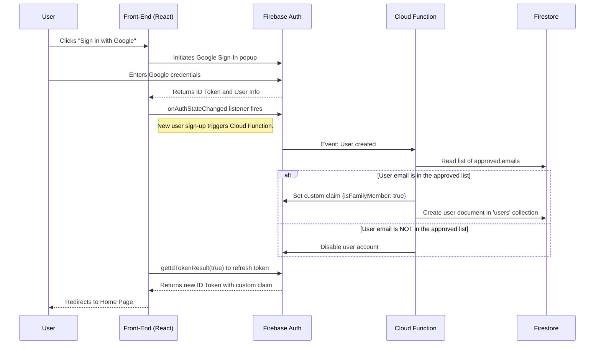

# **🔐 Authentication and Authorization: Detailed Flow**

This document details the end-to-end user authentication and authorization flow, ensuring that only approved family members can access the application.

## **1. End-to-End Authentication Flow**

The authentication process is designed to be secure and seamless, leveraging Firebase Authentication with Google Sign-In.



## **2. Cloud Function for Access Control**

A Cloud Function is the core of the authorization mechanism. It will be triggered automatically when a new user is created in Firebase Authentication.

*   **Trigger:** `functions.auth.user().onCreate()`
*   **Language:** Node.js (TypeScript) is recommended for Cloud Functions.

### **Implementation Details**

**`index.ts` (Cloud Function)**
```typescript
import * as functions from "firebase-functions";
import * as admin from "firebase-admin";

admin.initializeApp();

const db = admin.firestore();

// The list of approved family member emails.
// For better security, this should be stored in a secure configuration
// or a Firestore document with restricted write access.
const authorizedEmails = ["user1@example.com", "user2@example.com"];

export const processSignUp = functions.auth.user().onCreate(async (user) => {
  // Check if the user's email is in the authorized list.
  if (user.email && authorizedEmails.includes(user.email)) {
    // Set a custom claim to identify the user as a family member.
    await admin.auth().setCustomUserClaims(user.uid, { isFamilyMember: true });

    // Create a user document in Firestore.
    await db.collection("users").doc(user.uid).set({
      email: user.email,
      displayName: user.displayName,
      createdAt: admin.firestore.FieldValue.serverTimestamp(),
    });

    functions.logger.info(`User ${user.email} successfully authorized.`);
    return null;
  } else {
    // If the email is not in the list, disable the user's account.
    await admin.auth().updateUser(user.uid, { disabled: true });
    functions.logger.warn(`Unauthorized user ${user.email} signed up and was disabled.`);
    return null;
  }
});
```

### **Deployment**

1.  Initialize Firebase Functions in the project: `firebase init functions`.
2.  Install dependencies: `npm install firebase-admin firebase-functions`.
3.  Write the function code in `index.ts`.
4.  Deploy the function: `firebase deploy --only functions`.

This setup ensures that even if a user successfully authenticates with Google, they cannot access the application's data or services unless their email is on the pre-approved list. The custom claim (`isFamilyMember`) will be used in Firestore security rules and on the back-end API to enforce this access control.