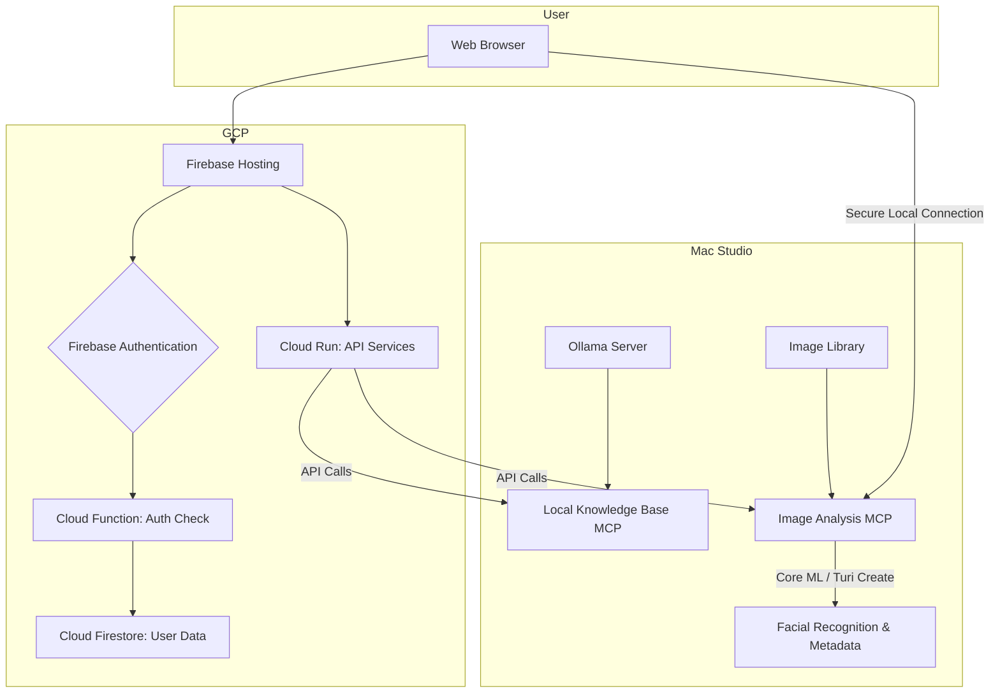

# **🏠 Family Assistant Project: Technical Architecture**

## **1. Overall Architecture**

This project uses a hybrid cloud/on-premise model to balance security, performance, and accessibility. The front-end and user authentication will be handled by GCP, while sensitive data and heavy processing will be handled by the on-premise Mac Studio.

## **2. On-Premise Infrastructure**

The on-premise infrastructure will run on the existing Mac Studio and handle all local data processing.

### **A. Local Knowledge Base MCP**

*   **Purpose:** Provide semantic search capabilities for local documents (PDFs, Word documents).
*   **Technology:**
    *   **Language:** Python
    *   **Framework:** Flask or FastAPI to create a simple API endpoint.
    *   **Model:** Existing Ollama installation will be used for generating embeddings and processing search queries.
    *   **Vector Database:** A local vector database (e.g., ChromaDB or FAISS) will be used to store document embeddings for efficient searching.
*   **Data Flow:**
    1.  A file scanner will periodically scan designated local folders for new or updated documents.
    2.  Documents will be parsed and chunked into smaller pieces.
    3.  Each chunk will be converted into a vector embedding using the Ollama model.
    4.  Embeddings will be stored in the local vector database.
    5.  The API will expose a search endpoint that takes a query, generates an embedding for the query, and searches the vector database for the most similar document chunks.

### **B. Image Analysis MCP**

*   **Purpose:** Provide facial recognition, XMP, and metadata analysis for the photography library.
*   **Technology:**
    *   **Language:** Python
    *   **Framework:** Flask or FastAPI.
    *   **ML Models:**
        *   **Facial Recognition:** Use Core ML models, potentially trained or fine-tuned using Turi Create. This will leverage the Mac Studio's Apple Silicon for high performance.
        *   **Metadata Extraction:** Use Python libraries like `Pillow` and `exifread` to extract XMP and EXIF data.
*   **Data Flow:**
    1.  A scanner will index the photo library.
    2.  For each image, the MCP will:
        *   Extract all available metadata.
        *   Run the facial recognition model to identify and tag people.
    3.  This information will be stored in a local database (e.g., SQLite or a JSON file) for fast lookups.
    4.  The API will provide endpoints to search for images based on people, dates, locations, and other metadata.

## **3. Cloud Infrastructure (GCP)**

The cloud infrastructure will host the user-facing application and manage user authentication.

### **A. Front-End**

*   **Hosting:** Firebase Hosting for simple, scalable, and secure static and dynamic content delivery.
*   **Framework:** A modern JavaScript framework like React or Vue.js is recommended for building a responsive and dynamic user interface.

### **B. Back-End Services**

*   **API:** Google Cloud Run will host a containerized back-end application (e.g., a Python Flask or Node.js Express app) that will act as a proxy between the front-end and the on-premise MCP servers. This provides a secure and scalable way to expose on-premise services to the cloud.
*   **Database:** Cloud Firestore will be used to store user data, application settings, and other non-sensitive information.

### **C. User Authentication**

*   **Service:** Firebase Authentication will be used to handle Google Sign-In.
*   **Access Control:**
    1.  When a user signs in for the first time, a Cloud Function will be triggered.
    2.  The function will check the user's email against a predefined list of authorized family member emails stored in a secure location (e.g., a Firestore document with restricted access rules or Google Secret Manager).
    3.  If the email is on the list, a custom claim (e.g., `isFamilyMember: true`) will be added to the user's authentication token.
    4.  If the email is not on the list, the user's account will be disabled or flagged, and they will be denied access to the application.
    5.  Front-end and back-end security rules will enforce that only users with the `isFamilyMember: true` claim can access data and services.

## **4. Hybrid Connectivity**

*   The front-end application will be designed to detect if the user is on the local network.
*   When on the local network, the application will make direct requests to the on-premise MCP servers for features like image search.
*   When outside the local network, these features will be disabled in the UI. A secure connection method (e.g., a VPN or a secure tunnel) could be considered for future implementation to allow remote access to on-premise services.

## **5. Assistant Agent (Cloud)**

A dedicated cloud-based MCP server will handle chat functionality and integration with Google services.

*   **Purpose:** Provide a chat interface for interacting with Gmail and Google Calendar.
*   **Technology:**
    *   **Hosting:** Google Cloud Run.
    *   **Authentication:** Securely manages user authentication with Google services via OAuth 2.0.
    *   **Language Model:** Integrates with the Gemini API for natural language understanding and generation.
*   **Detailed Design:** For more information, see the [ASSISTANT_AGENT_DESIGN.md](ASSISTANT_AGENT_DESIGN.md) document.
